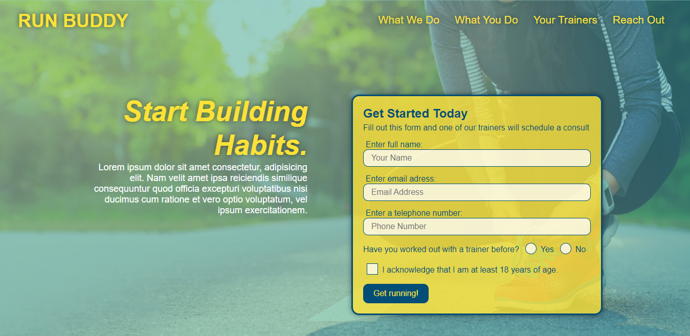

# Run Buddy, Inc

## Purpose
A website that offers fitness training services.

## :label: Description
Asynchronous Activity #1 - UCF's Coding Bootcamp. 
In this activity I created a website for an imaginary fitness company called 'Run Buddy, Inc' using HTML and CSS only.

## 	:hash: Coding Languages Used
:heavy_check_mark: HTML 
:heavy_check_mark: CSS 

## :desktop_computer: Website
Link to Website: https://padredilg.github.io/run-buddy/
  
Screenshot from Website:

## :clap: Contribution
Made with ❤️ by Luiz

### ©️2019 Run Buddy, Inc

 Padredilg/padredilg.github.io
